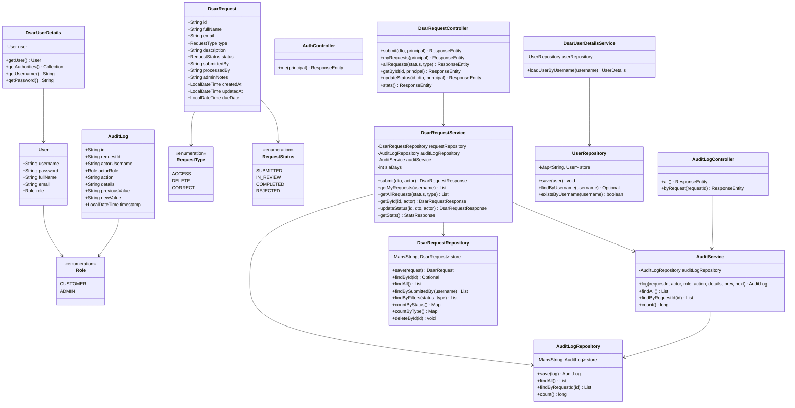

# 📍 UML Class Diagram

This diagram shows the full domain model, service layer, and repository structure of the DSAR Portal backend.

```mermaid
classDiagram
    class User {
        +String username
        +String password
        +String fullName
        +String email
        +Role role
    }

    class DsarRequest {
        +String id
        +String fullName
        +String email
        +RequestType type
        +String description
        +RequestStatus status
        +String submittedBy
        +String processedBy
        +String adminNotes
        +LocalDateTime createdAt
        +LocalDateTime updatedAt
        +LocalDateTime dueDate
    }

    class AuditLog {
        +String id
        +String requestId
        +String actorUsername
        +Role actorRole
        +String action
        +String details
        +String previousValue
        +String newValue
        +LocalDateTime timestamp
    }

    class Role {
        <<enumeration>>
        CUSTOMER
        ADMIN
    }

    class RequestType {
        <<enumeration>>
        ACCESS
        DELETE
        CORRECT
    }

    class RequestStatus {
        <<enumeration>>
        SUBMITTED
        IN_REVIEW
        COMPLETED
        REJECTED
    }

    class DsarRequestService {
        -DsarRequestRepository requestRepository
        -AuditLogRepository auditLogRepository
        -AuditService auditService
        -int slaDays
        +submit(dto, actor) DsarRequestResponse
        +getMyRequests(username) List
        +getAllRequests(status, type) List
        +getById(id, actor) DsarRequestResponse
        +updateStatus(id, dto, actor) DsarRequestResponse
        +getStats() StatsResponse
    }

    class AuditService {
        -AuditLogRepository auditLogRepository
        +log(requestId, actor, role, action, details, prev, next) AuditLog
        +findAll() List
        +findByRequestId(id) List
        +count() long
    }

    class DsarRequestRepository {
        -Map~String, DsarRequest~ store
        +save(request) DsarRequest
        +findById(id) Optional
        +findAll() List
        +findBySubmittedBy(username) List
        +findByFilters(status, type) List
        +countByStatus() Map
        +countByType() Map
        +deleteById(id) void
    }

    class AuditLogRepository {
        -Map~String, AuditLog~ store
        +save(log) AuditLog
        +findAll() List
        +findByRequestId(id) List
        +count() long
    }

    class UserRepository {
        -Map~String, User~ store
        +save(user) void
        +findByUsername(username) Optional
        +existsByUsername(username) boolean
    }

    class DsarRequestController {
        +submit(dto, principal) ResponseEntity
        +myRequests(principal) ResponseEntity
        +allRequests(status, type) ResponseEntity
        +getById(id, principal) ResponseEntity
        +updateStatus(id, dto, principal) ResponseEntity
        +stats() ResponseEntity
    }

    class AuditLogController {
        +all() ResponseEntity
        +byRequest(requestId) ResponseEntity
    }

    class AuthController {
        +me(principal) ResponseEntity
    }

    class DsarUserDetails {
        -User user
        +getUser() User
        +getAuthorities() Collection
        +getUsername() String
        +getPassword() String
    }

    class DsarUserDetailsService {
        -UserRepository userRepository
        +loadUserByUsername(username) UserDetails
    }

    User --> Role
    DsarRequest --> RequestType
    DsarRequest --> RequestStatus
    AuditLog --> Role
    DsarRequestService --> DsarRequestRepository
    DsarRequestService --> AuditService
    DsarRequestService --> AuditLogRepository
    AuditService --> AuditLogRepository
    DsarRequestController --> DsarRequestService
    AuditLogController --> AuditService
    DsarUserDetails --> User
    DsarUserDetailsService --> UserRepository
```
