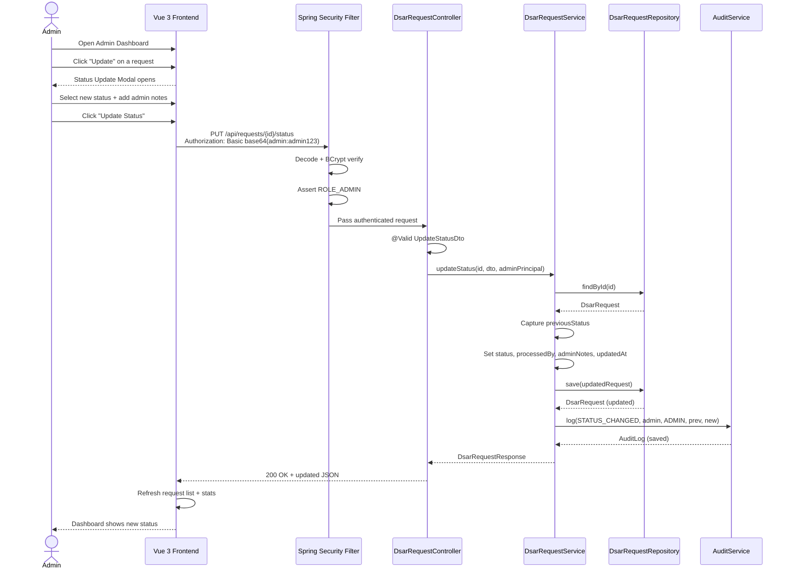

# 🔄 Sequence Diagram — Admin Updates Request Status

This diagram shows the flow when an admin reviews and updates the status of a DSAR.

```mermaid
sequenceDiagram
    actor Admin
    participant Frontend as Vue 3 Frontend
    participant Security as Spring Security Filter
    participant Controller as DsarRequestController
    participant Service as DsarRequestService
    participant ReqRepo as DsarRequestRepository
    participant Audit as AuditService

    Admin->>Frontend: Open Admin Dashboard
    Admin->>Frontend: Click "Update" on a request
    Frontend-->>Admin: Status Update Modal opens
    Admin->>Frontend: Select new status + add admin notes
    Admin->>Frontend: Click "Update Status"
    Frontend->>Security: PUT /api/requests/{id}/status<br/>Authorization: Basic base64(admin:admin123)
    Security->>Security: Decode + BCrypt verify
    Security->>Security: Assert ROLE_ADMIN
    Security->>Controller: Pass authenticated request
    Controller->>Controller: @Valid UpdateStatusDto
    Controller->>Service: updateStatus(id, dto, adminPrincipal)
    Service->>ReqRepo: findById(id)
    ReqRepo-->>Service: DsarRequest
    Service->>Service: Capture previousStatus
    Service->>Service: Set status, processedBy, adminNotes, updatedAt
    Service->>ReqRepo: save(updatedRequest)
    ReqRepo-->>Service: DsarRequest (updated)
    Service->>Audit: log(STATUS_CHANGED, admin, ADMIN, prev, new)
    Audit-->>Service: AuditLog (saved)
    Service-->>Controller: DsarRequestResponse
    Controller-->>Frontend: 200 OK + updated JSON
    Frontend->>Frontend: Refresh request list + stats
    Frontend-->>Admin: Dashboard shows new status
```
