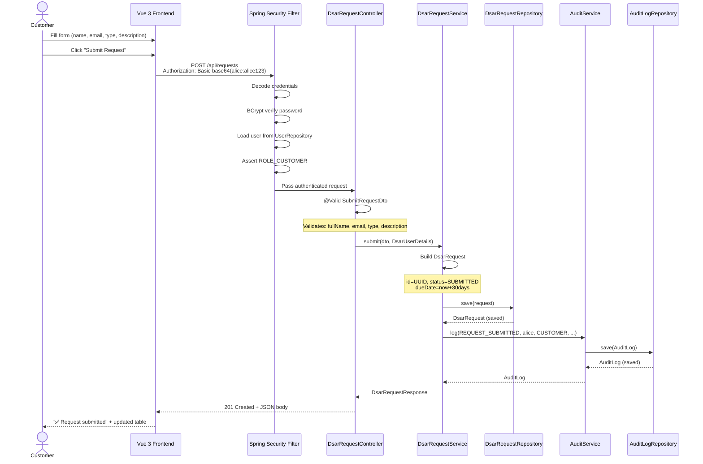

# 🔄 Sequence Diagram — Customer Submits a DSAR

This diagram shows the full request flow when a customer submits a Data Subject Access Request.

```mermaid
sequenceDiagram
    actor Customer
    participant Frontend as Vue 3 Frontend
    participant Security as Spring Security Filter
    participant Controller as DsarRequestController
    participant Service as DsarRequestService
    participant ReqRepo as DsarRequestRepository
    participant Audit as AuditService
    participant AuditRepo as AuditLogRepository

    Customer->>Frontend: Fill form (name, email, type, description)
    Customer->>Frontend: Click "Submit Request"
    Frontend->>Security: POST /api/requests<br/>Authorization: Basic base64(alice:alice123)
    Security->>Security: Decode credentials
    Security->>Security: BCrypt verify password
    Security->>Security: Load user from UserRepository
    Security->>Security: Assert ROLE_CUSTOMER
    Security->>Controller: Pass authenticated request
    Controller->>Controller: @Valid SubmitRequestDto
    Note over Controller: Validates: fullName, email, type, description
    Controller->>Service: submit(dto, DsarUserDetails)
    Service->>Service: Build DsarRequest
    Note over Service: id=UUID, status=SUBMITTED<br/>dueDate=now+30days
    Service->>ReqRepo: save(request)
    ReqRepo-->>Service: DsarRequest (saved)
    Service->>Audit: log(REQUEST_SUBMITTED, alice, CUSTOMER, ...)
    Audit->>AuditRepo: save(AuditLog)
    AuditRepo-->>Audit: AuditLog (saved)
    Audit-->>Service: AuditLog
    Service-->>Controller: DsarRequestResponse
    Controller-->>Frontend: 201 Created + JSON body
    Frontend-->>Customer: "✅ Request submitted" + updated table
```
